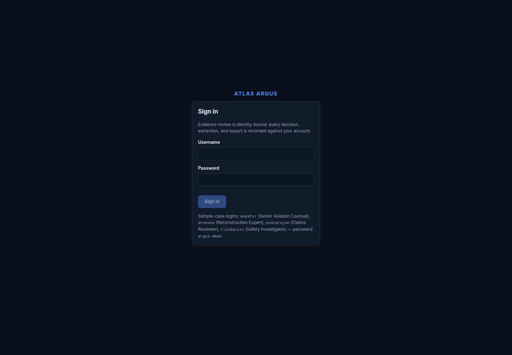
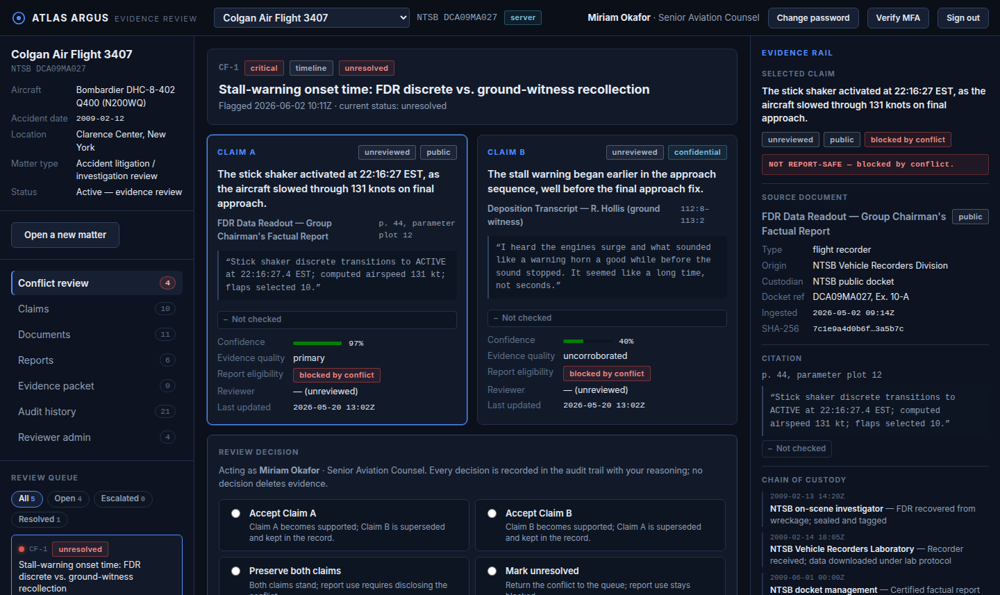
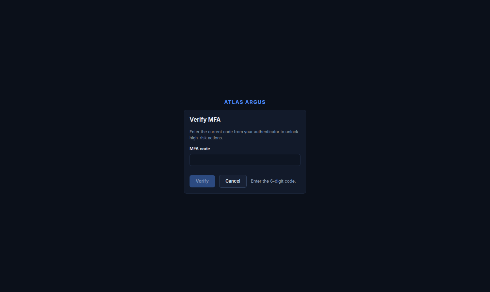
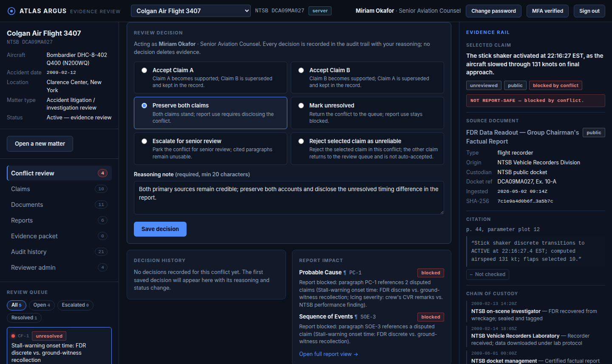
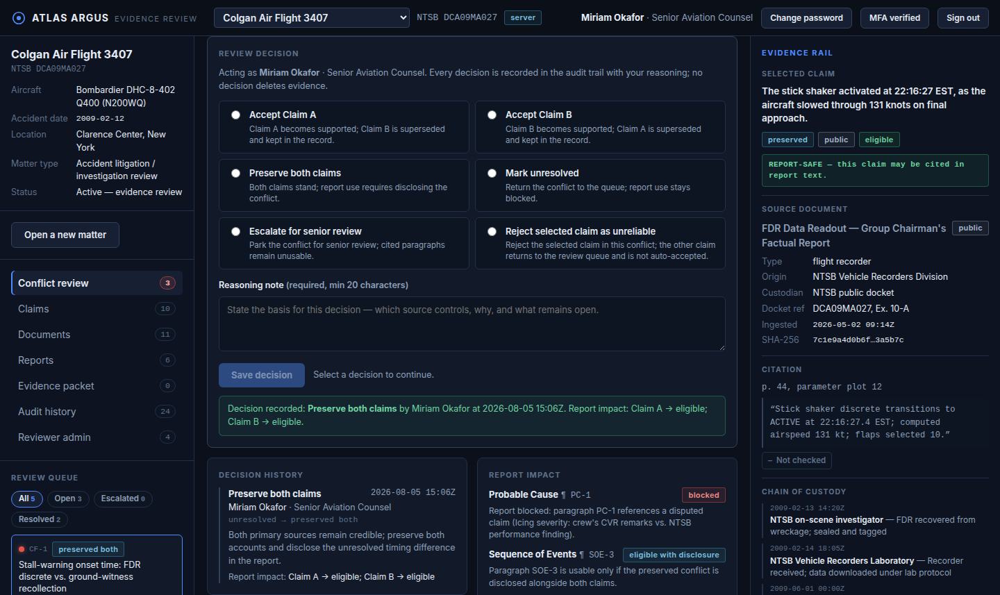
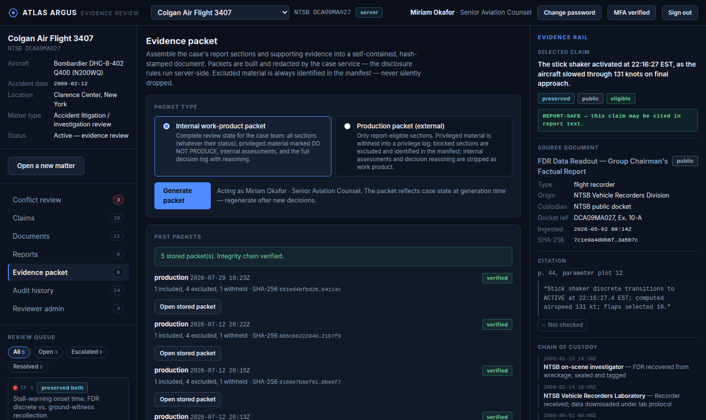
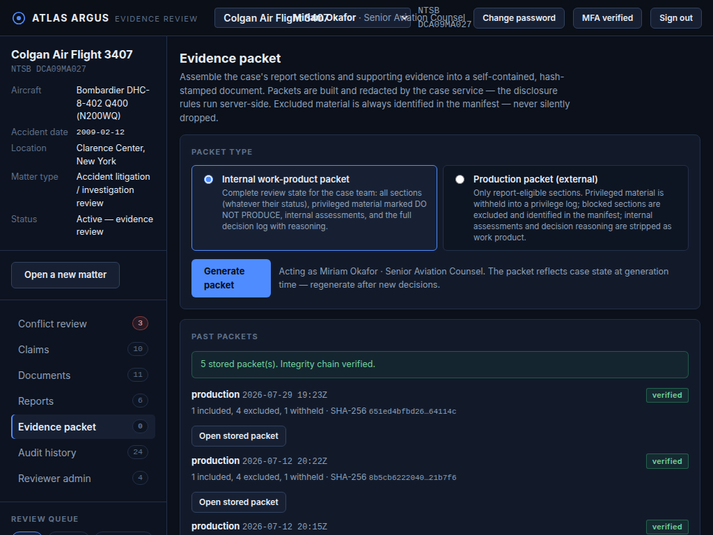
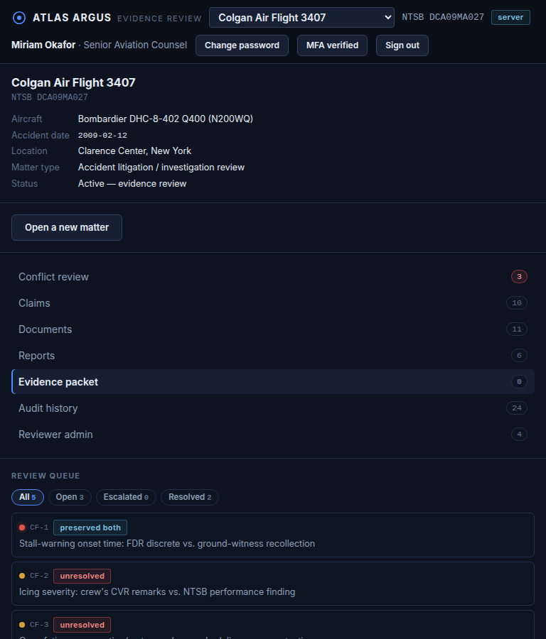

# Atlas Argus product design audit

Date: 2026-08-05

## Scope

Evidence-based review of the representative counsel workflow in the local demo environment:

1. Sign in
2. Review a claim conflict
3. Complete MFA verification
4. Enter and save a review decision
5. Confirm the recorded outcome
6. Review the evidence-packet workspace
7. Check responsive reflow at 1024 px and 768 px

The audit used the product's current dark evidence-review interface and existing sample matter. It recorded one local demo decision (`Preserve both claims`) and re-enrolled the demo reviewer's MFA factor while exercising the flow. No production data was used.

## Overall assessment

Atlas Argus has a strong trust and traceability model. It consistently exposes privilege state, source attribution, report impact, decision history, packet verification, actor, and time. The product feels serious and appropriate for evidence-sensitive legal work.

The main weakness is task hierarchy. The persistent three-pane shell presents matter context, queue state, claims, evidence, and the current action at nearly equal visual priority. This makes important actions harder to locate and causes a confirmed responsive failure at 1024 px. The mobile breakpoint avoids direct overlap, but places the entire matter/navigation/queue stack before the active workspace.

## Captured journey

### 1. Sign in — generally healthy

- Clear security-oriented framing and explicit field labels.
- The very small sample-login copy weakens the otherwise production-like trust signal and is likely difficult to read.
- The disabled primary action and muted helper text need measured contrast verification.
- No visible password reveal or account-recovery path is offered.

### 2. Conflict review — needs attention

- Side-by-side claim comparison, privilege labels, source traceability, and report-safety status are strong.
- The three persistent columns compete for attention; the evidence rail repeats context already present in the queue and comparison area.
- The decision control begins below the initial viewport, so the principal task and its save action are not discoverable at a glance.
- Small muted labels and compact filters increase reading and target-size risk.

### 3. MFA verification — mostly healthy

- The requirement and six-digit input are direct, and the blocker message explains why verification cannot proceed.
- MFA is a full-screen context switch reached from the header, rather than an in-context step-up when a protected decision is saved.
- No resend, recovery, or alternate-factor route is visible.

### 4. Decision composition — clear but overloaded

- Each decision option explains its effect, the selected option uses more than color alone, and the reasoning requirement is visible.
- The primary action and report-impact preview are clear once the user reaches the form.
- Six verbose choices, the queue, matter details, comparison content, and evidence rail remain simultaneously active, creating avoidable cognitive load.
- The decision area should become the dominant task while contextual evidence becomes collapsible or summarized.

### 5. Decision confirmation — strong

- The result includes the decision, actor, time, and report effect; history and report-safety state update consistently.
- Text labels accompany color changes, preserving meaning without relying on red/green alone.
- The success message sits low in a reset form and competes with empty decision controls above it; focus placement and announcement should be verified with assistive technology.

### 6. Evidence packet — trustworthy, but insufficiently task-focused

- Internal and production packet types explain disclosure consequences, and prior artifacts show verification status.
- The claim-specific evidence rail is not relevant to packet generation and consumes substantial width.
- The action lacks a concise preflight summary of included, excluded, privileged, and unresolved material before generation.
- Repeated `Open stored packet` controls have identical accessible names, making them difficult to distinguish in a screen-reader button list.
- Cryptic hashes dominate the history rows without a clearer human-readable grouping or artifact identity.

### 7. 1024 px reflow — critical

- The header does not reflow soon enough: matter selector, identity, docket metadata, and actions visibly overlap.
- This makes core context unreadable and controls ambiguous at a common tablet/small-laptop width and is likely to worsen under browser zoom.
- The layout moves the evidence rail, but the header breakpoint does not match that structural change.

### 8. 768 px reflow — needs attention

- Direct header collision is resolved and controls wrap.
- The entire matter summary, navigation, and review queue precede the active evidence-packet workspace, pushing the selected task below the first screen.
- On a narrow viewport, matter context and queue should collapse behind progressive-disclosure controls so the active task appears immediately after the header.

## Priority recommendations

1. **Fix the responsive shell first.** Reflow or collapse header controls before 1024 px, prevent text/control overlap, and make the active workspace precede secondary context on narrow screens.
2. **Give the current task a dominant lane.** Collapse the evidence rail when it duplicates context, allow the matter/queue sidebar to become a drawer, and keep the decision summary and action visible while reviewing.
3. **Make MFA an in-context step-up.** Trigger it from the protected save/generate action, retain the user's draft, and return focus to the action after verification.
4. **Add packet preflight and safer artifact navigation.** Summarize disclosure counts and blockers before generation; give each stored-packet action a unique accessible name using type, date, or identifier.
5. **Run a measured accessibility pass.** Verify text/control contrast, focus visibility, keyboard order, target sizes, status announcements, zoom/reflow at 200% and 400%, high-contrast mode, and screen-reader behavior.

## Accessibility notes

Positive evidence includes explicit labels, semantic-looking radio groups, visible selected states, textual status badges, and result copy that does not depend only on color. Confirmed risks are the 1024 px collision and identical packet-button labels. Small muted typography and weak disabled-state contrast are visual risks, not measured WCAG failures in this audit.

## Limits

This review covers the captured local demo states at 1440×1000/857, 1024×768, and 768×900. It does not certify WCAG conformance. Screen-reader announcements, keyboard-only operation, programmatic names beyond the observed packet controls, contrast ratios, touch behavior, reduced-motion preferences, high-contrast modes, and 200%/400% zoom were not fully tested.
